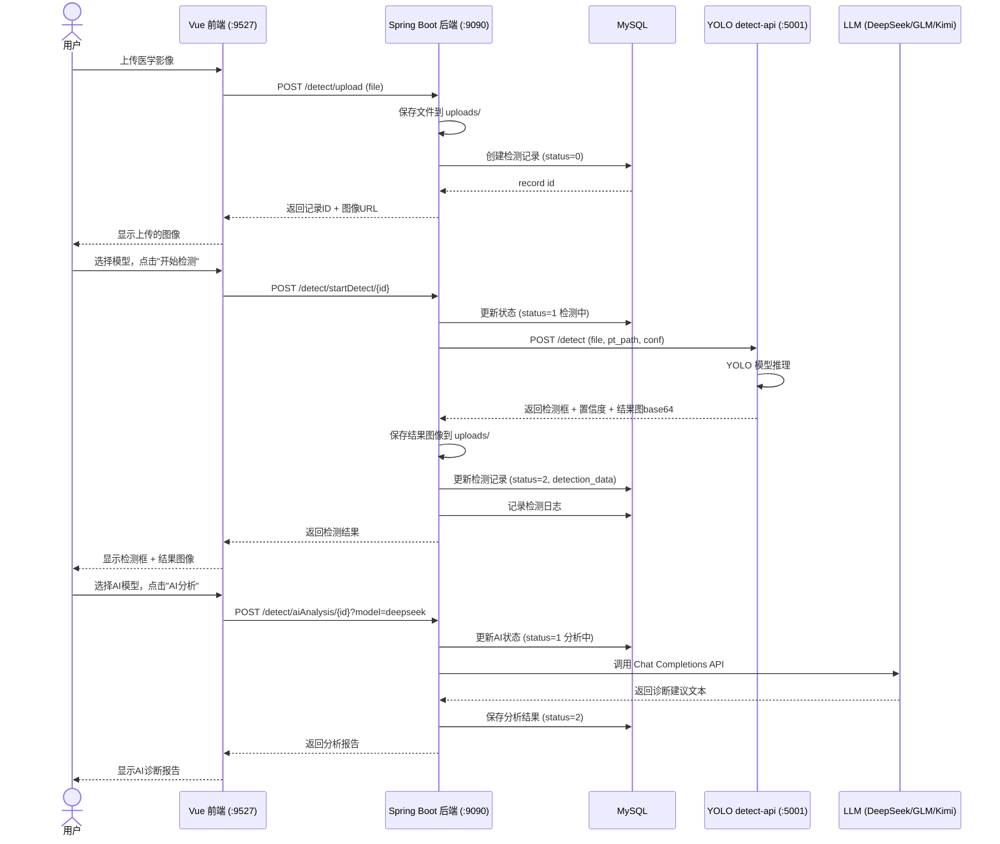
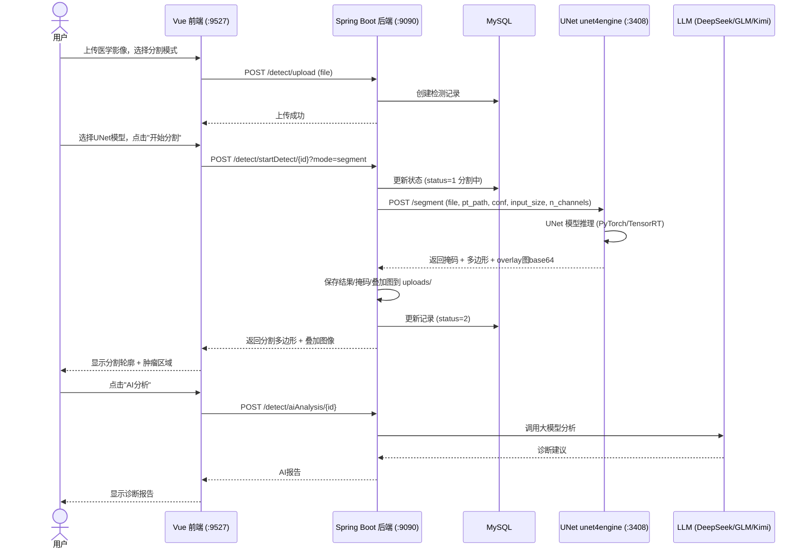
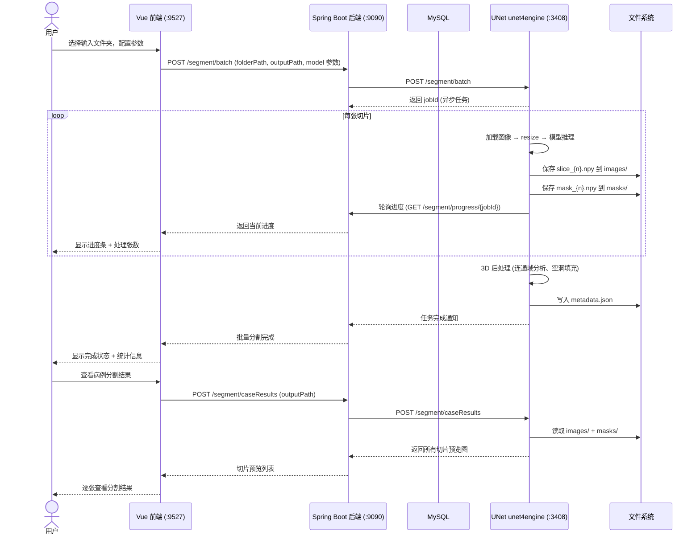
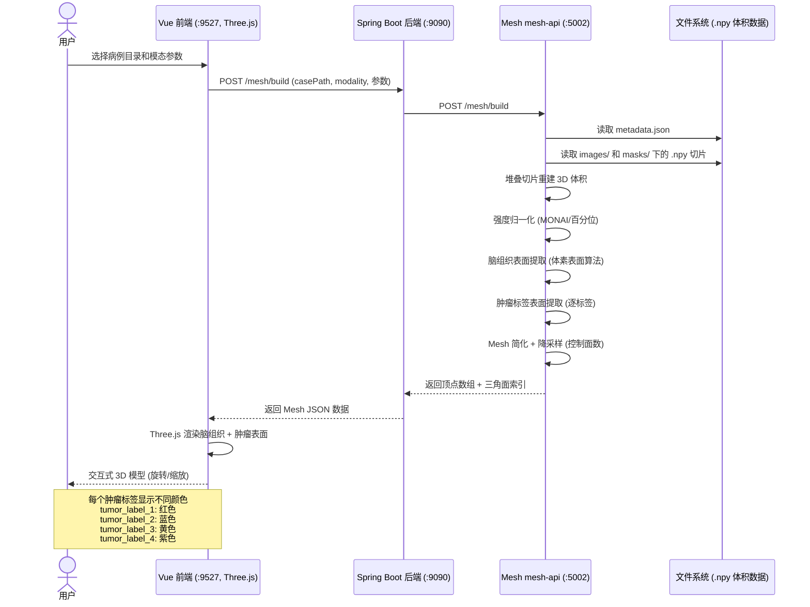
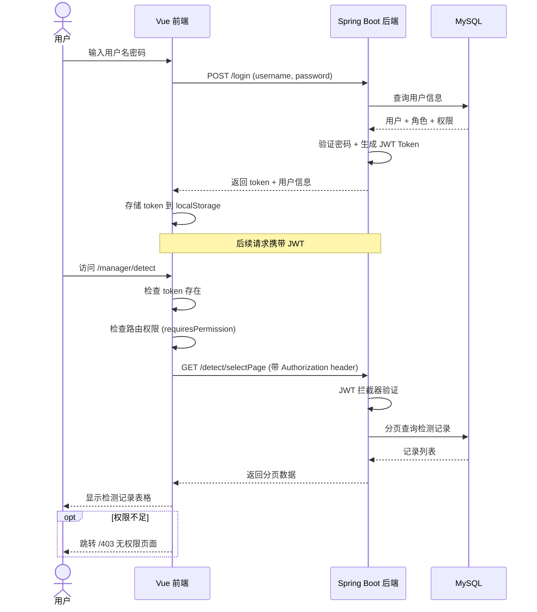

# 脑肿瘤辅助诊断系统 — 项目架构与服务关系

## 一、整体架构概览

```
┌─────────────────────────────────────────────────────────────┐
│                    用户浏览器 (Vue SPA)                       │
│                  http://localhost:9527                       │
└──────────────────────┬──────────────────────────────────────┘
                       │ REST API
                       ▼
┌─────────────────────────────────────────────────────────────┐
│              Spring Boot 后端 (springb)                       │
│              http://localhost:9090                           │
│                                                             │
│  ┌──────────┐  ┌──────────┐  ┌──────────┐  ┌─────────────┐ │
│  │Controller│  │ Service  │  │  Mapper  │  │  AIService  │ │
│  │  层      │→ │  业务层  │→ │  数据层  │  │  LLM 调用   │ │
│  └──────────┘  └──────────┘  └──────────┘  └──────┬──────┘ │
│                                                    │        │
│  ┌──────────────────────────────────────────┐      │        │
│  │      Python 检测服务调用 (HttpRequest)    │      │        │
│  └──────────┬──────────────────────┬────────┘      │        │
└─────────────┼──────────────────────┼───────────────┼────────┘
              │                      │               │
              ▼                      ▼               ▼
     ┌────────────────┐   ┌────────────────┐  ┌──────────────┐
     │ YOLO 检测服务   │   │ UNet 分割服务   │  │  外部 LLM    │
     │ detect-api.py  │   │ unet4engine.py │  │ DeepSeek     │
     │ port:5001      │   │ port:3408      │  │ GLM / Kimi   │
     └────────────────┘   └───────┬────────┘  └──────────────┘
                                  │
                                  ▼
                       ┌────────────────┐
                       │ Mesh 重建服务   │
                       │ mesh-api.py    │
                       │ port:5002      │
                       └────────────────┘
```

---

## 二、项目模块详述

### 2.1 主项目 `D:\YDS\code`（工作目录）

| 模块 | 技术栈 | 端口 | 说明 |
|------|--------|------|------|
| `springb/` | Java + Spring Boot + MyBatis | 9090 | 主后端，提供 REST API、数据库操作、调用 Python 服务和 LLM |
| `vue/` | Vue 3 + Element Plus + Vite | 9527 | 前端 SPA，用户交互界面 |
| `detect_service/` | Python Flask | 多个 | 检测微服务集合 |
| `docs/` | Markdown | - | 项目文档目录 |

#### springb 后端分层

```
springb/src/main/java/com/example/springb/
├── controller/
│   ├── AdminController.java       # 管理员接口
│   ├── DetectController.java      # 检测核心接口（上传、检测、AI分析）
│   ├── WebController.java         # 通用页面接口
│   └── ...其他控制器
├── service/
│   ├── AIService.java             # LLM 调用（DeepSeek / GLM / Kimi）
│   ├── DetectService.java         # 检测业务逻辑
│   ├── ConfigService.java         # 动态配置
│   ├── AdminService.java          # 管理员业务
│   ├── DataviewService.java       # 数据统计
│   └── DetectionLogService.java   # 检测日志
├── entity/                        # 数据实体
├── mapper/                        # MyBatis Mapper
├── config/                        # 配置类
├── common/                        # 公共工具 (Result, CorsConfig)
├── security/                      # JWT + 角色权限
├── utils/                         # 工具类
└── exception/                     # 全局异常处理
```

#### vue 前端路由

```
/login                 登录页
/manager/admin         管理后台
/manager/detect        脑肿瘤图像检测（YOLO）
/manager/mask          分割检测（UNet 2D）
/manager/multi         批量分割
/manager/threedim      3D 可视化
/manager/history       检测历史
/manager/dataview      数据统计看板
/manager/config        系统配置（管理员）
```

#### detect_service 服务集合

| 文件 | 端口 | 说明 |
|------|------|------|
| `mesh-api.py` | 5002 | 3D Mesh 重建：从分割体积重建表面网格 |
| `unet4threedim.py` | 3408 | UNet 2D 分割服务（单张+批量），支持 PyTorch/TensorRT |
| `segment-batch-api.py` | - | 批量分割的独立服务 |
| `detect_api.py`（旧版） | - | 曾被删除（`git status` 中显示 `D detect_service/app.py`） |

---

### 2.2 算法服务 `D:\algorithms\V11-dmt`（YOLO 算法工程）

| 文件 | 端口 | 说明 |
|------|------|------|
| `detect-api.py` | 5001 | **YOLO 脑肿瘤检测主服务**，使用 Ultralytics YOLO 模型 |
| `blade_yolo_api.py` | - | 肺结节/刀具检测 API |
| `brain_yolo_api.py` | - | 脑部专用 YOLO API |
| `skin_yolo_api.py` | - | 皮肤病变检测 API |
| `train.py` | - | YOLO 模型训练脚本 |
| `ultralytics/` | - | 定制的 Ultralytics 框架（含改进模块） |

**detect-api.py 核心接口：**

| 端点 | 方法 | 说明 |
|------|------|------|
| `/health` | GET | 健康检查 |
| `/detect` | POST | 单张图像检测（支持 detect/segment 模式） |
| `/batch_detect` | POST | 批量检测 |
| `/models` | GET | 列出可用模型 |

**支持的肿瘤类型：**
- `gl` — 胶质瘤 (glioma)
- `me` — 脑膜瘤 (meningioma)
- `pi` — 垂体瘤 (pituitary)

---

### 2.3 UNet 算法服务 `D:\algorithms\Pytorch-UNet-master`

| 文件 | 端口 | 说明 |
|------|------|------|
| `unet4engine.py` | 3408 | UNet + TensorRT 加速的分割服务（主服务） |
| `unet4threedim.py` | - | 早期版本的 3D UNet 分割 |
| `train.py` / `train-resize.py` | - | UNet 训练脚本 |
| `unet2onnx.py` | - | UNet 转 ONNX 导出 |
| `predict.py` | - | 单张预测 |

**unet4engine.py 核心接口：**

| 端点 | 方法 | 说明 |
|------|------|------|
| `/health` | GET | 健康检查 |
| `/segment` | POST | 单张图像分割 |
| `/segment/batch` | POST | 启动批量分割任务 |
| `/segment/progress/<job_id>` | GET | 查询批量任务进度 |
| `/segment/caseResults` | POST | 恢复病例分割预览 |
| `/segment/stop` | POST | 停止批量任务 |
| `/segment/validatePath` | POST | 验证路径有效性 |
| `/memory/clear` | POST | 清理 GPU 内存 |

**分割标签：**
- 背景 (background)
- 胶质瘤 (glioma) — label 1
- 脑膜瘤 (meningioma) — label 2
- 垂体瘤 (pituitary) — label 3

**多标签（3D 场景）：**
- 标签 1 — 坏死肿瘤核心
- 标签 2 — 瘤周水肿
- 标签 3 — 增强肿瘤

---

## 三、服务调用关系（时序泳道图）

### 3.1 脑肿瘤检测流程（detect 模式）



### 3.2 脑肿瘤分割流程（mask 模式）



### 3.3 批量分割流程



### 3.4 3D 可视化流程



### 3.5 用户认证与权限流程



---

## 四、数据存储

| 存储 | 技术 | 说明 |
|------|------|------|
| 关系数据库 | MySQL | 用户、检测记录、配置、日志等 |
| 文件存储 | 本地文件系统 `uploads/` | 原始图像、检测结果图像 |
| .npy 切片 | 本地文件系统 | UNet 批量分割输出的图像/掩码切片 |
| 模型文件 | 本地文件系统 `D:/algorithms/V11-dmt/runs/brain/` | YOLO .pt 模型 |
| UNet 模型 | 本地文件系统 `D:/algorithms/Pytorch-UNet-master/checkpoints/` | UNet .pth / .engine 模型 |

---

## 五、三个关键服务文件的关系

### 5.1 `D:\YDS\code\detect_service\mesh-api.py`
- **定位**：3D Mesh 重建微服务
- **依赖**：Flask, NumPy, SciPy, MONAI（可选）
- **功能**：从已分割的 3D 体积（.npy 切片堆叠）重建脑组织和肿瘤的表面网格
- **调用方**：Spring Boot 后端（在 3D 可视化场景中被调用）
- **端口**：5002

### 5.2 `D:\algorithms\V11-dmt\detect-api.py`
- **定位**：YOLO 脑肿瘤检测主服务
- **依赖**：Flask, Ultralytics YOLO, Pillow
- **功能**：对单张医学图像执行目标检测（边界框）或实例分割（多边形），输出肿瘤类型和置信度
- **调用方**：Spring Boot 后端（在 Detect 页面检测场景中被调用）
- **端口**：5001

### 5.3 `D:\algorithms\Pytorch-UNet-master\unet4engine.py`
- **定位**：UNet 脑肿瘤分割服务（TensorRT 加速）
- **依赖**：Flask, PyTorch, TensorRT, PyCUDA, NumPy, SciPy, OpenCV
- **功能**：对单张或批量医学图像执行像素级分割，输出掩码和多边形
- **调用方**：Spring Boot 后端（在 Mask/Multi 页面分割场景中被调用）
- **端口**：3408

### 关系总结

```
                         ┌───────────────────┐
                         │   Vue Frontend     │
                         │   (:9527)          │
                         └────────┬──────────┘
                                  │ HTTP
                                  ▼
                         ┌───────────────────┐
                         │ Spring Boot Backend│
                         │   (:9090)          │
                         └──┬──────┬──────┬──┘
                            │      │      │
                   HTTP     │      │      │     HTTP
              ┌─────────────┘      │      └─────────────┐
              ▼                    ▼                    ▼
    ┌──────────────────┐ ┌────────────────┐ ┌──────────────────┐
    │YOLO detect-api   │ │ UNet unet4     │ │ Mesh mesh-api    │
    │(:5001)           │ │ engine (:3408) │ │ (:5002)          │
    │目标检测/实例分割  │ │像素级语义分割   │ │3D表面网格重建     │
    │2D图像 → 检测框   │ │2D图像 → 掩码   │ │3D体积 → 顶点+面  │
    └──────────────────┘ └────────────────┘ └──────────────────┘
```

**三者的分工**：detect-api 负责"找"（在哪里、是什么），unet4engine 负责"切"（精确边界），mesh-api 负责"建"（3D 可视化）。它们各自独立部署，通过 Spring Boot 后端统一编排，前端无感知。
